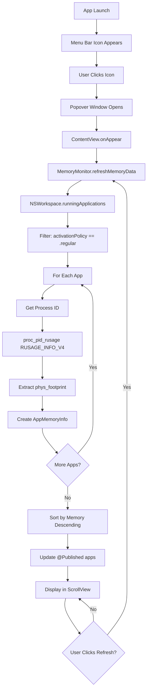
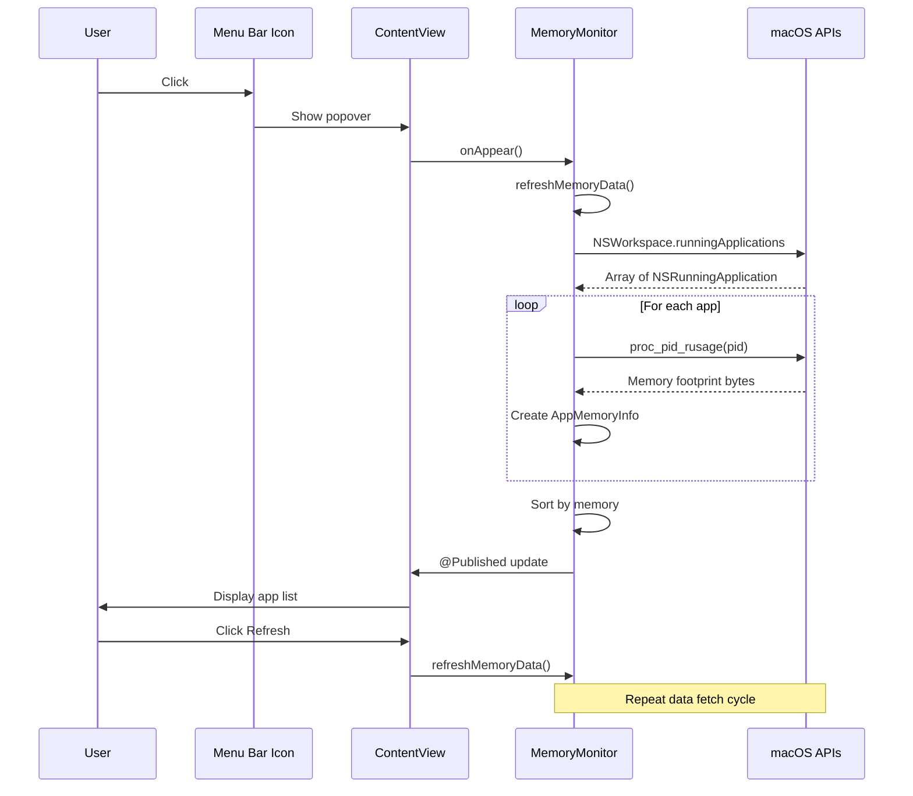
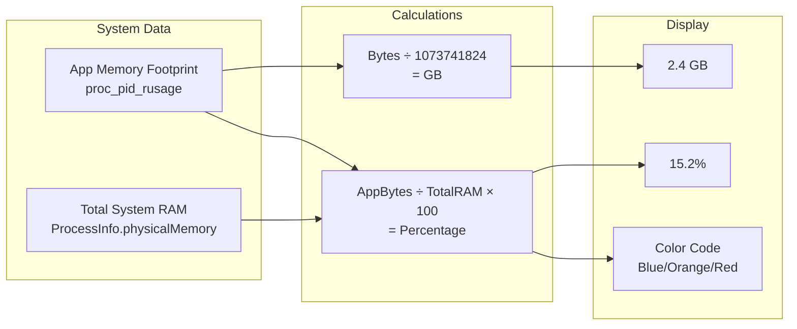

# Mac Memory Monitor - Architecture & Flow

## Application Flow



## Component Architecture

```mermaid
graph LR
    subgraph App [MacMemoryApp]
        Entry[MacMemoryApp.swift<br/>@main entry point]
    end
    
    subgraph UI [User Interface]
        Content[ContentView<br/>Main popover view]
        Row[AppRowView<br/>Individual app row]
        Content --> Row
    end
    
    subgraph Data [Data Layer]
        Model[AppMemoryInfo<br/>Data model]
        Monitor[MemoryMonitor<br/>@ObservableObject]
    end
    
    subgraph System [System APIs]
        NS[NSWorkspace<br/>Get running apps]
        Proc[proc_pid_rusage<br/>Get memory usage]
    end
    
    Entry -->|MenuBarExtra| Content
    Content -->|@StateObject| Monitor
    Monitor -->|@Published| Model
    Monitor --> NS
    Monitor --> Proc
    Row -->|displays| Model
```

## Data Flow



## Memory Calculation



## Key Technologies

| Component | Technology | Purpose |
|-----------|-----------|---------|
| UI Framework | SwiftUI | Modern declarative UI |
| Menu Bar | MenuBarExtra | Native menu bar integration |
| Data Flow | ObservableObject + @Published | Reactive updates |
| Process List | NSWorkspace | Get running applications |
| Memory Data | proc_pid_rusage | Accurate memory footprint |
| Memory Calc | ProcessInfo | Total system memory |
| App Info | NSRunningApplication | App name, icon, PID |

## Configuration Details

### Info.plist
- `LSUIElement = YES` - No Dock icon (agent app)
- Minimum macOS version: 13.0

### Entitlements
- `com.apple.security.app-sandbox = false` - Disabled to read process memory
- Required for `proc_pid_rusage()` on other processes

### Build Settings
- Swift 5.0
- macOS 13.0+ deployment target
- Hardened Runtime enabled
- SwiftUI Previews enabled

